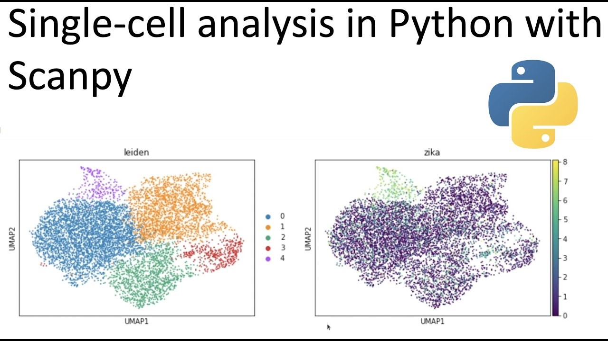

# Bioinformatician & Data Analyst

#### A passionate data analyst who delves deep into big data in the field of biology  skilled in: 
#### Python, R, Linux,  Data Manipulation, Data Visualization, Biological Data Analysis

## Education
- M.Sc., Human Genetics	| Tehran University of Medical Sciences(_May 2023_)	 			        		
- B.Sc., Laboratory Sciences | Hamadan University of Medical Sciences (_July 2020_)

## Work Experience
**Lab Technician @ Pasteur Institute of Iran (_Dec 2020 - Present_)** 
- Proficient in operating AFM, real-time PCR, and fluorescent microscopy
- Skilled in data and image analysis, providing insightful interpretations crucial for research advancements
- Experienced in niosome synthesis
- Dedicated to instrument maintenance and providing exceptional services to fellow researchers, facilitating their scientific endeavors

## Research & Teaching Experience
#### RA | Pasteur Institute of Iran | 2020-Present
•	Collaboration in Niosome synthesis, WB, and Cell culture experiments
•	Image Processing for publication (Topographical images, Vesicles, and Bacteria)
#### RA | Tehran University of Medical Sciences | 2024-Present
•	Collaborating in a thesis project about 5-HTTLRP & COVID-19
#### TA | Pasteur Institute of Iran | 2022-Present
•	Lecturer of AFM and Real-time PCR workshops
•	Training new team members

  
#  Computer Skills

- Skilled in R, Python, Linux, Machine Learning, and related repositories, libraries and packages
- Experienced in NGS (WES, Analysis of 10 real-world clinical cases), Microarray, Bulk RNA
- Single Cell seq Analyses, Spatial Transcriptomics, Methylation, sc/ATAC, ChIP, CITE Seq
- Metabolomics, Proteomics and Lipidomics
- Biostatistics, SPSS, GraphPad Prism
- Primer Design, Drug Design, Cystoscape, STRING, Bioinformatics databases and online tools 

## Projects
[Kaggle](https://www.kaggle.com/mohammadyaghmouri)

#### Single Cell Analysis: scanpy

A Single Cell Data Analysis Using "scanpy ,anndata". The Dataset Was Obtained From a Previously Published Paper : Cano-Gamez, E., Soskic, B., Roumeliotis, T.I. et al. Single-cell transcriptomics identifies an effectorness gradient shaping the response of CD4+ T cells to cytokines. Nat Commun 11, 1801 (2020). https://doi.org/10.1038/s41467-020-15543-y

#### Spatial Transcriptomics 
A Spatial transcriptomics Analysis Using "Scanpy and Squidpy"

#### Breast Cancer Diagnosis ML Models

Used **ML** to Explore the Predictive Power of Machine Learning on Breast Cancer Detection

#### Titanic Survival Prediction
A competition on kaggle : use machine learning to create a model that predicts which passengers survived the Titanic shipwreck

#### Spotify 2023 Most Streamed Songs
It provides insights into each song's attributes, popularity, and presence on various music platforms

#### Supermarket Sales: A Thorough EDA
One of the historical sales of supermarket company which has recorded in 3 different branches for 3 months data
#### Car Ads 2020
An analysis of huge number of car advertisments in the US. In this analysis several questions were answered regarding this valuable information

.png)

[GitHub](https://www.github.com/BioGenGeek)

#### Transcriptome Analysis
A brief RNA analysis on Airway dataset , a built-in dataset in R

#### Bisulfite Seq Analysis
Using edgeR Packge to Analyze Bisulfite Seq Data in R

#### Human Resources Data
A SQL analysis and PowerBI visualization on the distribution of employees 

# Courses

• SU, USMx: Overview & Management of Parkinson’s Disease

• SU, USMx: Alzheimer’s Disease & Dementia Care

• Advanced Neurobiology I

•	Machine Learning for Bioinformatics (Sharif University) 

•	Access Bioinformatics Databases with Biopython (Coursera)

•	SARS-CoV-2 Protein Modeling and Drug Docking (Coursera)

•	Fundamental Skills In Bioinformatics (Coursera)

•	Data Analysis with Python-IBM (Coursera)

•	R Programming- Johns Hopkins University (Coursera)

•	Bioconductor for Genomic Data Science - Johns Hopkins University (Coursera) 

•	Metabolomics, Lipidomics & Proteomics (Colorado State University) 

•	NGS Analysis (Genomefan Institute) 

•	Transcriptomics Analysis (ICBCONGRESS) 

•	Drug Design with Bioinformatic Approaches (BioinfCamp Co.)

# Publications

- Yaghmouri M, Safdari Lord J, Amini M, Yekaninejad MS, Izadi P. The association of rs17713054 with Neanderthal origin at 3p21. 31 locus with the severity of COVID-19 in Iranian patients. Scientific Reports. 2024 
  Jul 1;14(1):1-6.
  
- Yaghmouri M, Izadi P. Role of the Neanderthal Genome in Genetic Susceptibility to COVID-19: 3p21. 31 Locus in the Spotlight. Biochemical Genetics. 2024 Feb 12:1-25. 
  
- Letafati A., Salahi O., Yaghmouri M., Vasheghani A., et al. The Role of Pyroptosis in Respiratory Virus Infections (in progress)

#### Congress (2024)

- Afsharpour,M., Yaghmouri, M., Tarahomi, M.,  Maldar, M., The Impact of DNA Methylation Changes in DNA Repair Genes on the Risk of Colorectal Cancer in Patients with Lynch Syndrome Compared to a Control 
  Population. The International Congress on Cancer Genomics 2024 
- Yaghmouri, M., Exploring the Relationship Between Alzheimer's Disease and the Metabolome: Insights from mRNA Expression Analysis. The 8th International Congress on ‌Biomedicine 2024 
- Yaghmouri, M., Integration of Bioinformatics and Computational Biology in Deciphering Molecular Mechanisms of Atherosclerosis: A Novel Approach. The 10th International Congress on Biology 

#### BOOKS (in Edition)  

- Letafati A., Yaghmouri M., Haidari M., Masumi Z., et al. Epigenetic Clocks and Aging Biomarkers: From DNA Methylation to Biological Age
  
- Letafati A., Salehi A., Yaghmouri M., Askari MR., et al. NK Cell Exhaustion in Cancer: From Activation to Exhaustion
  
-	Letafati A., Yaghmouri M., Askari MR., et al. Interplay Between Tumor Suppressors Pathways & Oncogenic Signaling in Cancer
  
-	Letafati A., Nik S., Rahimi F., Yaghmouri M., et al.  Unveiling Amyotrophic Lateral Sclerosis: Understanding Neurological and Therapeutic Avenues                

